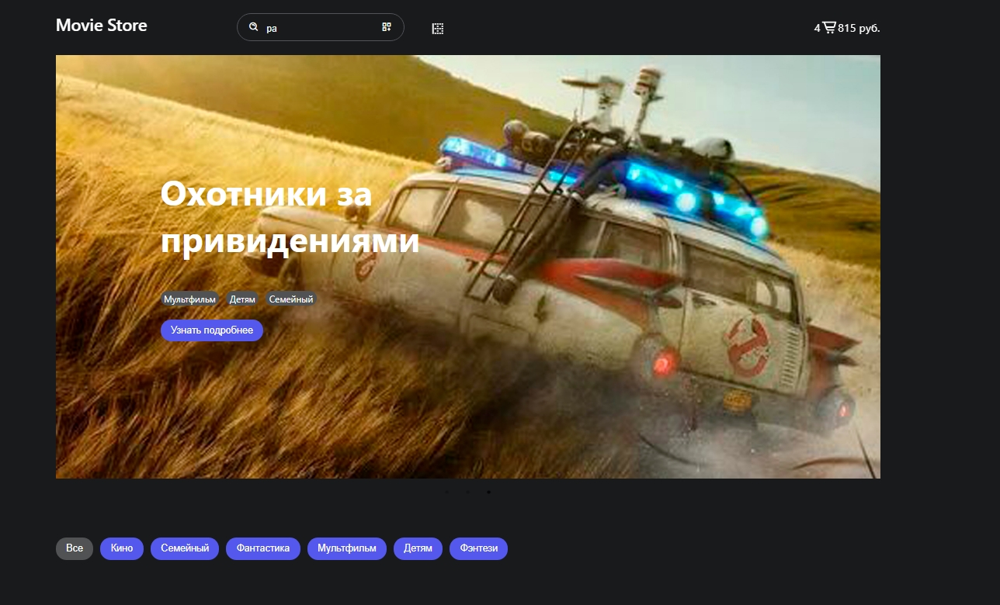

# Тестовый проект: магазин фильмов
#### Этот проект, сделан Омельченко Ольгой

## Функционал
* Добавление и удаление товаров из корзины
* Роитинг страниц
* Поиск товара
* Слайдер

___
## Для запуска проекта вам необходимо набрать команду в терминале:

**npm i**

#### После набрать команду:

**npm run dev**

___

### Технологии проекта
#### React 
#### React-Redux
#### React-Router 
#### React-Slick
#### Json-Server

___

### Установил следующие библиотеки в зависимости:

* react-redux
* react-router-dom
* redux-toolkit
* json-server
* react-slick
* react-carousel
* json-server
* react-icons
* classnames

  
___
### Для выполнения поставленных задач я использовал следующие библиотеки:
* redux, redux-toolkit - чтобы создавать асинхронные экшены
* react-router-dom - для роутинга
* classnames - для стилизации
* json-server - создание фейкового REST API
* react-slick - слайдер
